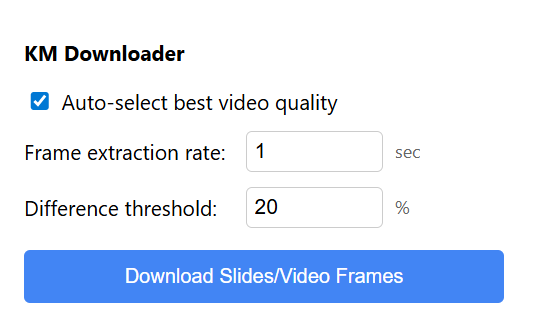

# KM downloader
針對KM學習系統中公開的PPT檔案，彙整所有圖檔並合併成完整的PDF供使用者下載。
只會對台大醫學院內科網站和醫學系共筆大平台開放使用，不會有其他任何網站的權限。

## Access
### Chrome extension store
Link: pending
還在審核，QQ，我又沒收集個資為什麼這麼難過...

### Install from source
1. Download ZIP

2. Unzip it.
3. Navigate to [chrome://extensions](chrome://extensions)
4. Turn on "developer mode" on the upper right corner.
5. Click "Load unpack" on the upper left corner and click the **inner** folder of the just unzipped directory (the folder with "manifest.json" inside).

6. Go to your webpage and click the extension button to find "KM downloader".

7. Click "start". If the desired target is a video, please hover your mouse onto the video time bar to see extraction progress.

## TODO
[] UI to remove unwanted frames

## Privacy Policy
This project does not collect any user data in any form. No original slides as Powerpoint, or any other form such that each slide is not in the format of an image file will be downloaded neither.

## Copyright Policy
All users that have the permission to download the slides should be already granted the access to them in the form of online viewing or video. The slides should already be accessible by manually screenshoting every page. This plugin only accelerate the process.

If the authors of the  downloaded slides request any copyrights issues, feel free to contact gostudyforurself@gmail.com .